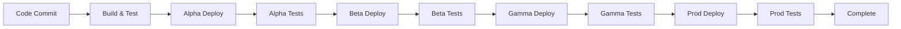

# MTB Wiki - Implementation Task List

## 📋 Phase Overview

This implementation will create a complete AWS-based infrastructure using CDK with:
- **Dev Fabric**: Alpha (isolated) + Beta (integrated) stages with synthetic data
- **Prod Fabric**: Gamma (prod data testing) + Prod (live) stages
- **Components**: PostgreSQL schema, client, AppSync GraphQL API
- **CI/CD**: CodePipeline with automated testing at each stage

## 🎯 Task Breakdown

### Phase 1: Repository Structure & Git Setup
- [ ] **1.1** Create logical repository structure
- [ ] **1.2** Setup .gitignore for AWS/CDK projects
- [ ] **1.3** Initialize CDK project structure
- [ ] **1.4** Setup package.json with all dependencies

### Phase 2: Database Layer
- [ ] **2.1** Commit current models to git
- [ ] **2.2** Design PostgreSQL schema from TypeScript models
- [ ] **2.2** Create database migration scripts
- [ ] **2.3** Build TypeScript database client (using Prisma or similar)
- [ ] **2.4** Create seed data generators (synthetic data)
- [ ] **2.5** Setup database connection pooling
- [ ] **2.6** Create database testing utilities

### Phase 3: Infrastructure Foundation (CDK)
- [ ] **3.1** Create VPC stack for Dev fabric
- [ ] **3.2** Create VPC stack for Prod fabric
- [ ] **3.3** Setup Aurora PostgreSQL cluster (Dev)
- [ ] **3.4** Setup Aurora PostgreSQL cluster (Prod)
- [ ] **3.5** Configure security groups and networking
- [ ] **3.6** Setup secrets management for database credentials

### Phase 4: GraphQL API Layer
- [ ] **4.1** Design GraphQL schema from TypeScript models
- [ ] **4.2** Create AppSync stack with CDK
- [ ] **4.3** Setup VTL resolvers for database operations
- [ ] **4.4** Configure AppSync data sources (Aurora)
- [ ] **4.5** Setup API authentication/authorization
- [ ] **4.6** Create GraphQL testing utilities

### Phase 5: CI/CD Pipeline Infrastructure
- [ ] **5.1** Create CodePipeline stack
- [ ] **5.2** Setup CodeBuild projects for each component
- [ ] **5.3** Create deployment stages (Alpha, Beta, Gamma, Prod)
- [ ] **5.4** Configure cross-account deployment (Dev → Prod fabric)
- [ ] **5.5** Setup artifact storage (S3)
- [ ] **5.6** Configure pipeline notifications (SNS)

### Phase 6: Testing Framework
- [ ] **6.1** Create unit test framework for database client
- [ ] **6.2** Create integration tests for GraphQL API
- [ ] **6.3** Setup synthetic data generation for Alpha/Beta
- [ ] **6.4** Create end-to-end test suites
- [ ] **6.5** Setup test data cleanup utilities
- [ ] **6.6** Configure test reporting and metrics

### Phase 7: Stage-Specific Configurations
- [ ] **7.1** Alpha Stage: Isolated component testing
- [ ] **7.2** Beta Stage: Integrated testing with synthetic data
- [ ] **7.3** Gamma Stage: Production data testing environment
- [ ] **7.4** Prod Stage: Live production deployment
- [ ] **7.5** Configure environment-specific parameters
- [ ] **7.6** Setup monitoring and alerting for each stage

### Phase 8: Deployment & Validation
- [ ] **8.1** Deploy Dev fabric infrastructure
- [ ] **8.2** Deploy Prod fabric infrastructure
- [ ] **8.3** Test pipeline end-to-end
- [ ] **8.4** Validate all stages work correctly
- [ ] **8.5** Setup monitoring dashboards
- [ ] **8.6** Create operational runbooks

## 📁 Proposed Repository Structure

```
MTBWiki/
├── packages/
│   ├── database/                    # Database layer
│   │   ├── schema/                  # SQL migrations
│   │   ├── client/                  # TypeScript client
│   │   ├── seeds/                   # Data seeding
│   │   └── tests/                   # Database tests
│   │
│   ├── api/                         # GraphQL API
│   │   ├── schema/                  # GraphQL schema
│   │   ├── resolvers/               # VTL resolvers
│   │   ├── datasources/             # AppSync data sources
│   │   └── tests/                   # API tests
│   │
│   └── types/                       # Shared TypeScript types
│       ├── models/                  # Core data models
│       ├── api/                     # GraphQL types
│       └── database/                # Database types
│
├── infrastructure/                  # CDK stacks
│   ├── lib/
│   │   ├── vpc/                     # VPC stacks
│   │   ├── database/                # Aurora stacks
│   │   ├── api/                     # AppSync stacks
│   │   ├── pipeline/                # CI/CD stacks
│   │   └── monitoring/              # CloudWatch stacks
│   │
│   ├── bin/                         # CDK apps
│   ├── config/                      # Environment configs
│   └── tests/                       # Infrastructure tests
│
├── tests/                           # Integration tests
│   ├── alpha/                       # Isolated component tests
│   ├── beta/                        # Integrated system tests
│   ├── gamma/                       # Production data tests
│   ├── e2e/                         # End-to-end tests
│   └── utils/                       # Test utilities
│
├── scripts/                         # Utility scripts
│   ├── deploy/                      # Deployment scripts
│   ├── data/                        # Data management
│   └── setup/                       # Environment setup
│
├── docs/                            # Documentation
│   ├── api/                         # API documentation
│   ├── deployment/                  # Deployment guides
│   └── architecture/                # System architecture
│
└── config/                          # Configuration files
    ├── environments/                # Environment-specific configs
    └── pipeline/                    # Pipeline configurations
```

## 🏗️ Infrastructure Components

### Dev Fabric
```typescript
// Alpha Stage (Isolated Testing)
- VPC: mtb-wiki-dev-vpc
- Aurora: mtb-wiki-alpha-db (small instance)
- AppSync: mtb-wiki-alpha-api
- Data: Synthetic only

// Beta Stage (Integration Testing)  
- VPC: mtb-wiki-dev-vpc (shared)
- Aurora: mtb-wiki-beta-db (small instance)
- AppSync: mtb-wiki-beta-api
- Data: Synthetic + some real data samples
```

### Prod Fabric
```typescript
// Gamma Stage (Pre-production)
- VPC: mtb-wiki-prod-vpc
- Aurora: mtb-wiki-gamma-db (production-like sizing)
- AppSync: mtb-wiki-gamma-api
- Data: Production data (read-only testing)

// Prod Stage (Live)
- VPC: mtb-wiki-prod-vpc (shared)
- Aurora: mtb-wiki-prod-db (production sizing)
- AppSync: mtb-wiki-prod-api
- Data: Live production data
```

## 🚀 Pipeline Flow



### Stage Gates
- **Alpha**: Unit tests, component isolation tests
- **Beta**: Integration tests, API contract tests
- **Gamma**: Production data validation, performance tests
- **Prod**: Smoke tests, health checks, rollback capability

## 📦 Dependencies & Tools

### CDK Dependencies
```json
{
  "@aws-cdk/core": "^2.x",
  "@aws-cdk/aws-rds": "^2.x",
  "@aws-cdk/aws-appsync": "^2.x",
  "@aws-cdk/aws-codepipeline": "^2.x",
  "@aws-cdk/aws-ec2": "^2.x",
  "@aws-cdk/aws-secretsmanager": "^2.x"
}
```

### Database Tools
```json
{
  "prisma": "^5.x",
  "@prisma/client": "^5.x",
  "pg": "^8.x",
  "@types/pg": "^8.x"
}
```

### Testing Tools
```json
{
  "jest": "^29.x",
  "@aws-sdk/client-appsync": "^3.x",
  "graphql-request": "^6.x",
  "testcontainers": "^10.x"
}
```

## ⚠️ Prerequisites

Before starting, ensure:
- [ ] AWS CLI configured with appropriate permissions
- [ ] Node.js 18+ installed
- [ ] CDK CLI installed globally
- [ ] Docker installed (for local testing)
- [ ] PostgreSQL client tools installed

## 🎯 Success Criteria

### Phase 1-3 Complete When:
- [ ] Repository structure is clean and logical
- [ ] Database schema matches TypeScript models
- [ ] Aurora clusters are deployed and accessible
- [ ] VPCs are properly configured with security

### Phase 4-6 Complete When:
- [ ] GraphQL API is fully functional
- [ ] All CRUD operations work through AppSync
- [ ] Test framework covers all components
- [ ] Synthetic data generation works

### Phase 7-8 Complete When:
- [ ] All four stages deploy successfully
- [ ] Pipeline runs end-to-end without manual intervention
- [ ] Tests pass at each stage gate
- [ ] Monitoring and alerting are functional

## 📋 Next Steps

1. **Review and approve this task list**
2. **Start with Phase 1**: Repository setup and git commit
3. **Proceed sequentially** through phases
4. **Test thoroughly** at each phase before moving forward
5. **Document everything** as we build

Would you like me to proceed with Phase 1, or would you like to modify any aspects of this plan? 